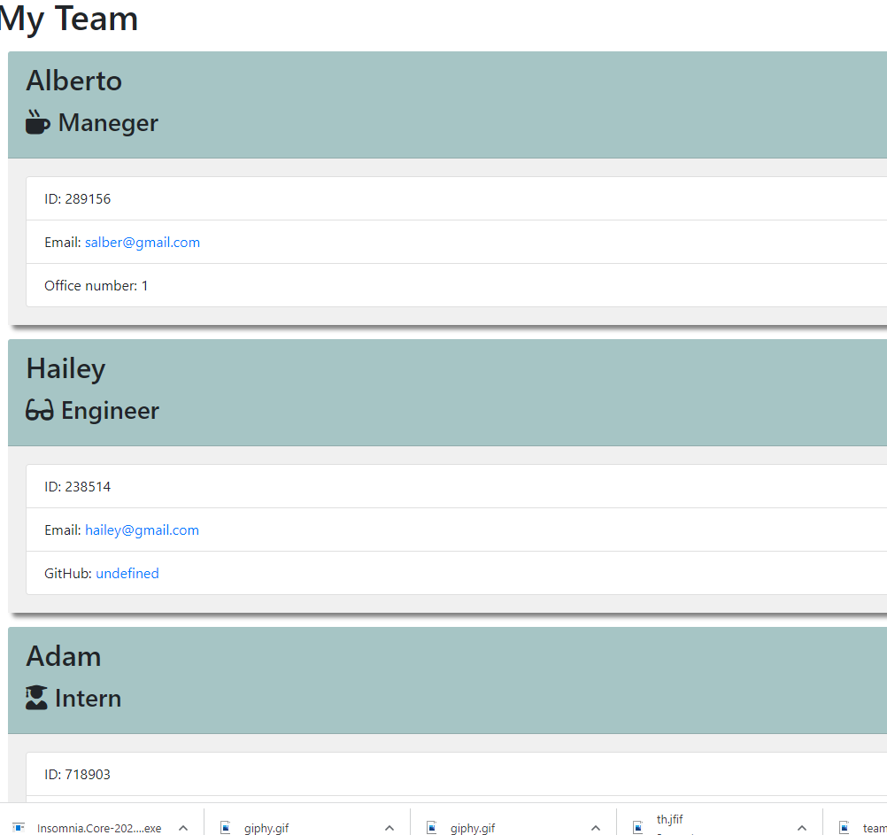

# Team-Profile-Genrator

## Screenshot

This is a screenshot of the generated HTML webpage.

## Walkthrough Video link

## Description

Building a Node.js command-line application that takes in information about employees on a software engineering team, and with that information generates an HTML webpage that displays the user input data.  
 This project also required the use of Jest and Inquirer to conduct unit tests of every part of the code to ensure that it would pass each test.

# Table of Contents

- [Installation](#installation)
- [Usage](#usage)
- [License](#license)
- [Tests](#tests)

## Usage

GIVEN a command-line application that accepts user input
WHEN prompted for the team members and their information
THEN an HTML file is generated that displays a nicely formatted team roster based on user input

WHEN I click on an email address in the HTML
THEN default email program opens and populates the TO field of the email with the address

WHEN click on the GitHub username
THEN that GitHub profile opens in a new tab

WHEN start the application
THEN prompted to enter the team manager’s name, employee ID, email address, and office number

WHEN enter the team manager’s name, employee ID, email address, and office number
THEN I am presented with a menu with the option to add an engineer or an intern or to finish building my team

WHEN select the engineer option
THEN prompted to enter the engineer’s name, ID, email, and GitHub username, and taken back to the menu

WHEN select the intern option
THEN prompted to enter the intern’s name, ID, email, and school, and taken back to the menu

WHEN decide to finish building my team
THEN exit the application, and the HTML is generated

## Installation

- Bootstrap: https://getbootstrap.com/
- NodeJS: https://nodejs.org/en/
- Jest: https://www.npmjs.com/package/jest
- Inquirer: https://www.npmjs.com/package/inquirer

## License
[The MIT License](https://opensource.org/licenses/MIT)

## Tests

Test.js files are included within the project testing the Employee, Manager, Engineer, and Intern classes.